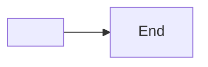

# Injection Fixture

Each block below would append a marker to the page if its script ran. None
of the markers may appear in the PDF.

```mermaid
flowchart LR
  a["</script><script>document.body.append('MERMAID-' + 'EXECUTED')</script>"] --> b[End]
```

Closing paragraph.
