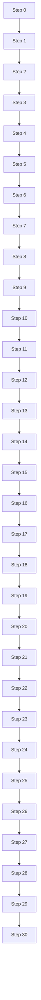

# Tall Diagram

```mermaid
flowchart TD
  n0[Step 0] --> n1[Step 1]
  n1[Step 1] --> n2[Step 2]
  n2[Step 2] --> n3[Step 3]
  n3[Step 3] --> n4[Step 4]
  n4[Step 4] --> n5[Step 5]
  n5[Step 5] --> n6[Step 6]
  n6[Step 6] --> n7[Step 7]
  n7[Step 7] --> n8[Step 8]
  n8[Step 8] --> n9[Step 9]
  n9[Step 9] --> n10[Step 10]
  n10[Step 10] --> n11[Step 11]
  n11[Step 11] --> n12[Step 12]
  n12[Step 12] --> n13[Step 13]
  n13[Step 13] --> n14[Step 14]
  n14[Step 14] --> n15[Step 15]
  n15[Step 15] --> n16[Step 16]
  n16[Step 16] --> n17[Step 17]
  n17[Step 17] --> n18[Step 18]
  n18[Step 18] --> n19[Step 19]
  n19[Step 19] --> n20[Step 20]
  n20[Step 20] --> n21[Step 21]
  n21[Step 21] --> n22[Step 22]
  n22[Step 22] --> n23[Step 23]
  n23[Step 23] --> n24[Step 24]
  n24[Step 24] --> n25[Step 25]
  n25[Step 25] --> n26[Step 26]
  n26[Step 26] --> n27[Step 27]
  n27[Step 27] --> n28[Step 28]
  n28[Step 28] --> n29[Step 29]
  n29[Step 29] --> n30[Step 30]
```
